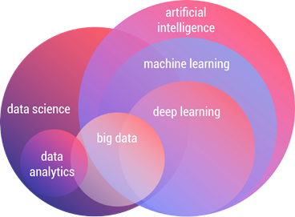

# Statistical Methods and ML models

## Big Data

Big data refers to extremely large datasets that may be analyzed computationally to reveal patterns, trends, and associations, especially relating to human behavior and interactions. It is characterized by the 5 Vs: Volume, Value , Velocity, Veracity and Variety.

## 5 Vs of Big Data

1. **Volume**: Refers to the vast amounts of data generated every second from various sources such as social media, sensors, and transactions.
2. **Velocity**: The speed at which data is generated and processed to meet the demands.
3. **Variety**: The different types of data (structured, unstructured, semi-structured) from various sources.
4. **Veracity**: The quality and accuracy of the data, which can affect the reliability of insights derived from it.
5. **Value**: The usefulness of the data in making decisions and driving business strategies.

## Machine Learning

Machine Learning (ML) is a subset of artificial intelligence that focuses on building systems that can learn from and make decisions based on data. It involves the use of algorithms and statistical models to enable computers to improve their performance on a specific task over time without being explicitly programmed.

### Relationship between AI, ML, and Data Science

Artificial Intelligence (AI) is a broad field that encompasses various techniques and approaches to create intelligent systems. Machine Learning (ML) is a subset of AI that focuses specifically on algorithms that allow computers to learn from data. Data Science, on the other hand, is an interdisciplinary field that uses scientific methods, processes, algorithms, and systems to extract knowledge and insights from structured and unstructured data. Data Science often employs ML techniques to analyze and interpret complex data sets.

### Types of Machine Learning

1. **Supervised Learning**: The model is trained on a labeled dataset, meaning that each training example is paired with an output label. Common algorithms include:

   - Linear Regression
   - Logistic Regression
   - Decision Trees
   - Support Vector Machines (SVM)
   - Neural Networks

2. **Unsupervised Learning**: The model is trained on an unlabeled dataset and must find patterns and relationships in the data. Common algorithms include:

   - K-Means Clustering
   - Hierarchical Clustering
   - Principal Component Analysis (PCA)
   - Autoencoders

3. **Reinforcement Learning**: The model learns by interacting with an environment and receiving feedback in the form of rewards or penalties. Common algorithms include:
   - Q-Learning
   - Deep Q-Networks (DQN)
   - Policy Gradient Methods

### Machine Learning Workflow

1. **Data Collection**: Gathering relevant data from various sources.
2. **Data Preprocessing**: Cleaning and transforming the data to make it suitable for analysis.
3. **Model Selection**: Choosing the appropriate machine learning algorithm based on the problem and data.
4. **Model Training**: Feeding the training data into the model to learn patterns.
5. **Model Evaluation**: Assessing the model's performance using metrics such as accuracy,
6. **Prediction**: Using the trained model to make predictions on new, unseen data.
