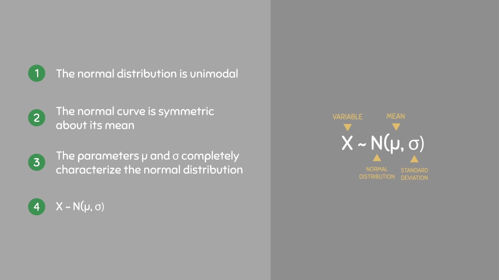

# Normal Distribution and Its Properties

A normal distribution, also called a bell curve or nomal curve, is a continuous probability distribution that is symmetric and bell-shaped, with most data clustering around the mean.

## Properties of Normal Distribution

1. Symmetry: The left and right sides of the distribution are mirror images.
2. Mean, Median, and Mode: In a normal distribution, these three measures of central tendency are all equal and located at the center of the distribution.
3. unimodal : The distribution has a single peak at the mean.
4. Asymptotic: The tails of the distribution approach, but never touch, the horizontal axis.
5. Empirical Rule: Approximately 68% of the data falls within one standard deviation of the mean, about 95% within two standard deviations, and about 99.7% within three standard deviations.
6. Defined by Mean and Standard Deviation: The shape and position

note : more widly spread means less height of the curve are determined by the mean (μ) and standard deviation (σ).

## 68 - 95 - 99.7 Rule

The 68-95-99.7 rule, also known as the empirical rule, states that in a normal distribution, approximately 68% of data falls within one standard deviation of the mean, 95% falls within two standard deviations, and 99.7% falls within three standard deviations. This rule is a useful shorthand for quickly estimating the spread of data in a normally distributed dataset.

[Video Reference](https://www.youtube.com/watch?v=mtbJbDwqWLE)
