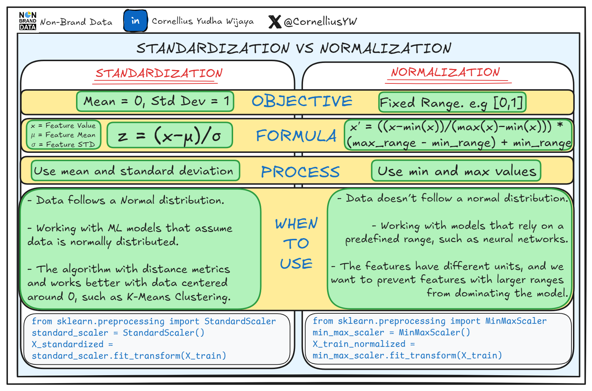

# Normalization and Standardization - Scaling Techniques

## What is Scaling ?

Scaling is a technique used to standardize the range of independent variables or features of data. In data processing, it is also known as data normalization and is generally performed during the data preprocessing step.

## Why Scaling is Important ?

1. **Improves Model Performance**: Many machine learning algorithms perform better when the input features are on a similar scale.
2. **Faster Convergence**: Scaling can lead to faster convergence during the training of models, especially for gradient descent-based algorithms.
3. **Prevents Dominance of Features**: In algorithms that compute distances (like KNN, SVM), unscaled features can dominate the distance calculations, leading to biased results.

## Normalization

Normalization is the process of rescaling the values of features to a common range, typically [0, 1]

Useful when data has a lot of variation.

example : size of house 100-10000 sqft and number of rooms 1-10

pixel values in image processing (0-255) are often normalized to [0, 1] for better performance in computer vision tasks.

### What Normalization does

Squeezes all values into a narrow range

Very sensitive to outliers (if one value is huge, everything gets squeezed)

### When to use Normalization

When scale matters, like distances

When data needs to be within a bounded range

Used commonly in:

Neural Networks (ANN, CNN, RNN)

K-NN

Distance-based algorithms

When you want all features treated equally by distance calculations

## Standardization

Standardization (also called Z-score scaling) transforms your data so that:

Mean = 0
Standard Deviation = 1

### What standardization does

Centers the data around 0

Spreads/“scales” the data based on how variable it is

Keeps outliers — it doesn’t squash them

### When to use Standardization

When the algorithm assumes Gaussian (normal) distribution

When the values vary a lot but outliers are important

Great for:

Linear Regression

Logistic Regression

SVM

K-Means

PCA

When features have different units (kg, cm, km, etc.)

## Super Simple Rule of Thumb

If your algorithm uses distances → Normalize
Examples: KNN, K-Means, Neural Networks

If your algorithm assumes data is normally distributed → Standardize
Examples: SVM, Logistic Regression, Linear Regression, PCA

## formula

